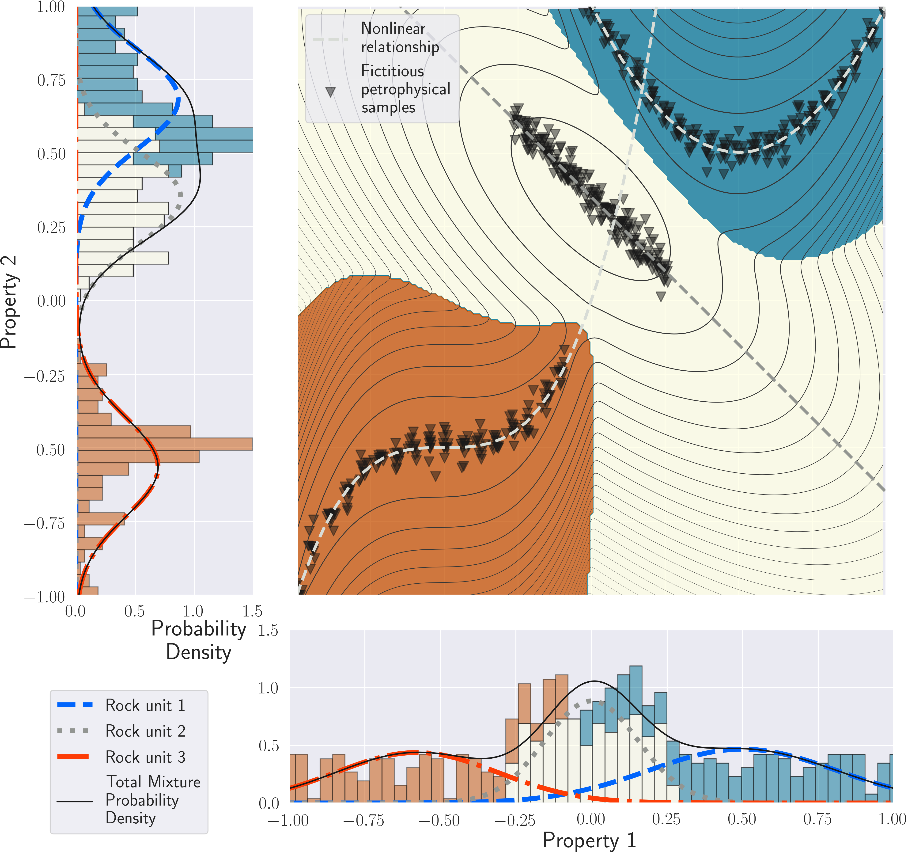

## Petrophysically and geologically guided multi-physics inversion using a dynamic Gaussian mixture model  

_Thibaut Astic, Lindsey J Heagy and Douglas W Oldenburg_

https://doi.org/10.1093/gji/ggaa378



## Summary

In a previous paper, we introduced a framework for carrying out petrophysically and geologically guided geophysical inversions. In that framework, petrophysical and geological information is modelled with a Gaussian mixture model (GMM). In the inversion, the GMM serves as a prior for the geophysical model. The formulation and applications were confined to problems in which a single physical property model was sought, and a single geophysical data set was available. In this paper, we extend that framework to jointly invert multiple geophysical data sets that depend on multiple physical properties. The petrophysical and geological information is used to couple geophysical surveys that, otherwise, rely on independent physics. This requires advancements in two areas. First, an extension from a univariate to a multivariate analysis of the petrophysical data, and their inclusion within the inverse problem, is necessary. Secondly, we address the practical issues of simultaneously inverting data from multiple surveys and finding a solution that acceptably reproduces each one, along with the petrophysical and geological information. To illustrate the efficacy of our approach and the advantages of carrying out multi-physics inversions coupled with petrophysical and geological information, we invert synthetic gravity and magnetic data associated with a kimberlite deposit. The kimberlite pipe contains two distinct facies embedded in a host rock. Inverting the data sets individually, even with petrophysical information, leads to a binary geological model: background or undetermined kimberlite. A multi-physics inversion, with petrophysical information, differentiates between the two main kimberlite facies of the pipe. Through this example, we also highlight the capabilities of our framework to work with interpretive geological assumptions when minimal quantitative information is available. In those cases, the dynamic updates of the GMM allow us to perform multi-physics inversions by learning a petrophysical model.
 

## Citation

Thibaut Astic, Lindsey J Heagy, Douglas W Oldenburg, Petrophysically and geologically guided multi-physics inversion using a dynamic Gaussian mixture model, Geophysical Journal International, Volume 224, Issue 1, January 2021, Pages 40–68, https://doi.org/10.1093/gji/ggaa378

```
@article{astic_inversion_2021,
    author = {Astic, Thibaut and Heagy, Lindsey J and Oldenburg, Douglas W},
    title = "{Petrophysically and geologically guided multi-physics inversion using a dynamic Gaussian mixture model}",
    journal = {Geophysical Journal International},
    volume = {224},
    number = {1},
    pages = {40-68},
    year = {2020},
    month = {08},
    issn = {0956-540X},
    doi = {10.1093/gji/ggaa378},
    eprint = {https://academic.oup.com/gji/article-pdf/224/1/40/34193255/ggaa378.pdf},
}

```
